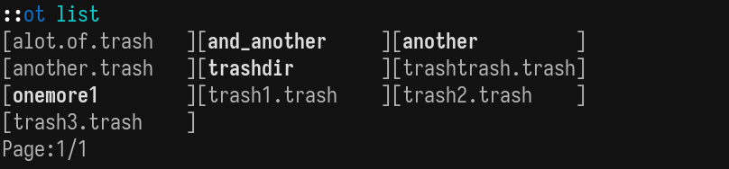
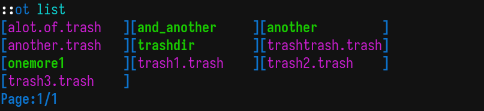
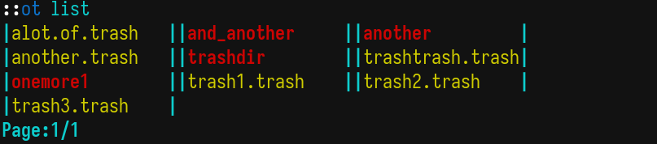

# onlytrash

A simple trashcan with few customizations for linux, send files to a trash directory restore them, purge it.

> A quick note: This app is still under development and it doesn't have all the planned features. Breaking changes may occur.

